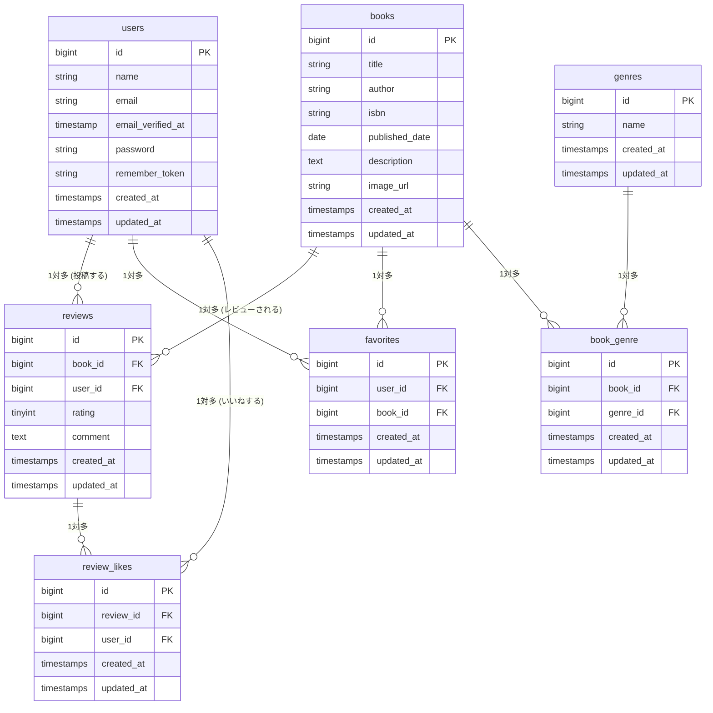

## プロジェクト名
COACHTECH 書籍レビューアプリ

## 概要
このプロジェクトは、バックエンド開発の基礎力を身につけるため、なるべくAIを使わずに作成したお問い合わせWebアプリケーションです。
書籍情報の閲覧からレビュー、いいね操作が可能。
ログイン時には、書籍情報の登録や編集やジャンルの操作が可能。
また、APIでの操作が可能。
Bladeはテンプレートを使用します。

## ＥＲ図




## 環境構築手順
### リポジトリをクローン
```bash
git clone https://github.com/Zackey64/bookshelf-app.git
```
### .envファイルの準備
.env.example をコピーして .env を作成
```bash
cp .env.example .env
```
Sail向けではないため、以下のように変更
```.env
DB_CONNECTION=mysql
DB_HOST=mysql
DB_PORT=3306
DB_DATABASE=laravel
DB_USERNAME=sail
DB_PASSWORD=password
```
### Composer依存パッケージのインストール
vendorディレクトリが存在しないため、以下を実行して、コンテナ内で `composer install` を実行
```bash
docker run --rm \
    -u "$(id -u):$(id -g)" \
    -v "$(pwd):/var/www/html" \
    -w /var/www/html \
    laravelsail/php82-composer:latest \
    composer install --ignore-platform-reqs
```
### Laravel Sailの起動
```bash
./vendor/bin/sail up -d
```
### アプリケーションキーの生成
```bash
sail artisan key:generate
```
### データベースのマイグレーションと初期データ投入
```bash
sail artisan migrate:fresh --seed
```
### フロントエンドのビルド
```bash
sail npm install
sail npm install alpinejs
sail npm run dev
```


## 使用技術
### フロントエンド
- Blade
- Tailwind CSS
### PHP
- Laravel
- Laravel Pint
- Laravel Fortify
- PHP Unit
### Docker
- Laravel Sail
### ツール
- Git/GitHub
- VScode

## APIエンドポイント一覧
| メソッド | パス | 概要 | 認証 |
| :--- | :--- | :--- | :--- |
| **GET** | `/api/v1/books` | 書籍一覧を取得 | 不要 |
| **GET** | `/api/v1/books/{book}` | 書籍詳細を取得 | 不要 |
| **POST** | `/api/v1/books` | 書籍を新規登録 | 不要 |
| **PUT** | `/api/v1/books/{book}` | 書籍を更新 | 不要 |
| **DELETE** | `/api/v1/books/{book}` | 書籍を削除 | 不要 |


## 開発環境URL
- Laravel : http://localhost
- phpMyAdmin : http://localhost:8080

## 作成者
Zackey64